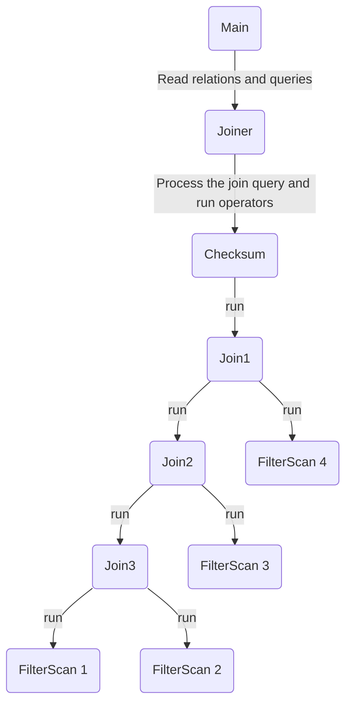
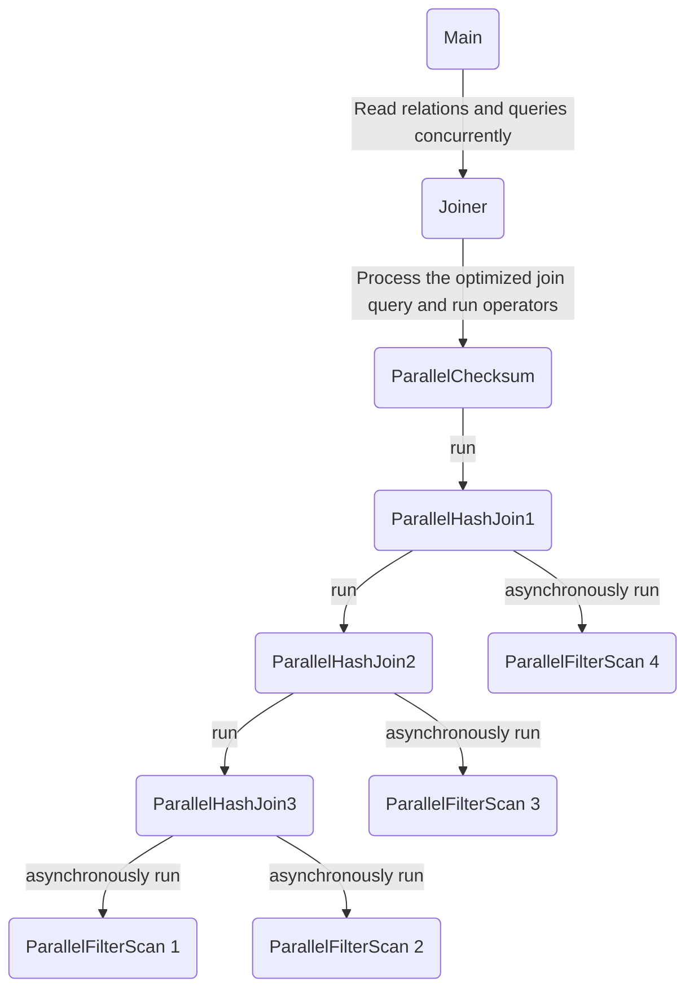
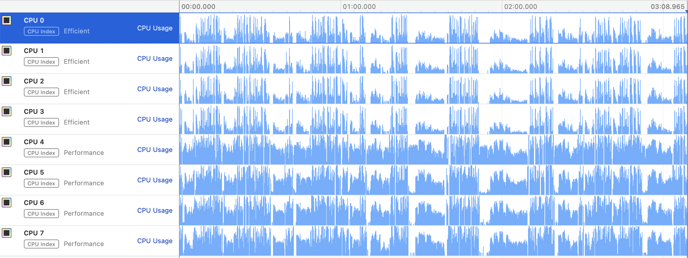
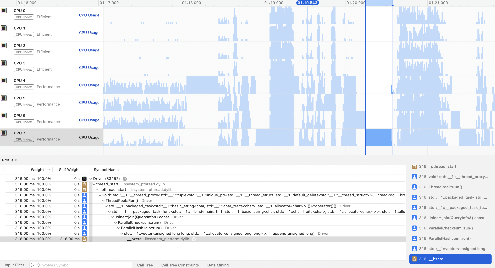

# 1. Parallel Join Processing

## 1. Structure and Flow Overview

1. This figure shows how the pure join processing program the TA provided works.  
2. It starts from main and reads the whole relations.  
3. Then, it reads and parses queries of a batch and does each join query one by one.  
4. The joiner analyzes the input query and builds the join tree as a result.
5. Having built the join tree, the joiner tries to execute the query plan described by the join tree.  
6. The execution starts from the root operator, `Checksum`.  
7. `Checksum` initiates the left tree and then executes the right tree/operator.  
8. The same procedure is repeatedly applied in the other sub-operators.

## 2. Objectives

To make the join as fast as I can, it is essential to identify what the most critical parts of join processing are.

## 3. My Algorithm

There are several ways I tried to enhance the computations.

1. Improve the data structures and algorithms to lower the computation complexity
2. Use task parallelism concept to compute the join processing and query processing
3. Preallocate some frequently used objects to fully utilize efficient memory allocations and deallocations (Object Pool)
4. Use of concurrent data structures (lock-free)
5. Take advantages of filtered relation sizes to optimize query plan

### 3.1 Improve the data structures and algorithms to lower the computation complexity

- Radix Partitioned Hash Join (My Design)
  - **Dramatically Improved** (about 52s to about 40s in total)

### 3.2 Task Parallelism

- [My Design] Partition the relation data concurrently
  - **Very Effective**
- [My Design] Fill the join records of each partition concurrently
  - **Very Effective**
- [My Design] Process each query in a batch concurrently
  - Slightly improved
- [My Design] Asynchronously scan the relation applied the filters
  - Slightly improved
- [My Design] Compute the checksums concurrently
  - Slightly improved

### 3.3 Object Pool & Preallocations

- [My Design] Thread Pool
  - **Effective** when doing a lot of tasks
  - since it saves construction costs of thread creations
- [My Design] Preallocations of `std::vector<T>` items constructions using its member function `std::vector<T>::reserve(reserved_size)`
  - **Very Effective**
  - it reduces about **40%** of running time (about 13s to about 5s for the medium dataset)
- [My Design] Use of Jemalloc
  - Effective in local environment (about 13s to about 8s for the medium dataset)
  - But not dramatically effective in the test environment
- Lock Pool
  - Not effective
  - Using locking protocol overwhelms the cost of allocation and deallocation of locks

### 3.4 Concurrent Data Structures

- Concurrent (Non-blocking) Linked-Lists / Hashmaps
  - Much Slower
    - Since the atomic operations imposed to atomic variables incur a lot of cache invalidation messages to paralyze bandwidth of cpu buses
    - To new/delete the node one by one makes the deallocation much slower

### 3.5 Query Optimizations

- [My Design] Query Optimization
  - Slightly Improved (about 5%)
    - Duplicate Filters
      - Smaller join calculations can be made by reducing the number of the result of Scan Operation
    - Pre-calculate the number of records from a filtered scan in order to compute smaller join operation first

## 4. Implementation details

### 1. Make three goal-specific thread pools to support task parallelism.

#### 1. Query Processing Job Pool in main.cpp for inter-query parallelism
 - to run multiple queries within a batch in parallel
 - This pool has `ThreadPool::GetSupportedHardwareThreads() * 0.5` threads
 - e.g. if 20 threads are supported in this machine, 10 threads can be used as inter-query parallelism
#### 2. Intra-operation Pool in Operators.cpp for intra-operation parallelism
 - to run a single operation faster by distributing multiple jobs to multiple threads
 - This pool has `ThreadPool::GetSupportedHardwareThreads() * 2.5` threads
 - e.g. if 20 threads are supported in this machine, 30 threads can be used as intra-operation parallelism
#### 3. Inter-operation Pool in Operators.cpp for inter-operation parallelism
 - to hide IO latency from filter scan operations by running asynchronously
 - This pool has `ThreadPool::GetSupportedHardwareThreads() * 0.5` threads
 - e.g. if 20 threads are supported in this machine, 10 threads can be used as inter-operation parallelism

#### ※ Why the size of 'Intra-operation Pool' is larger than 2 * (hardware-supported threads)?
- When processing the multiple queries or multiple scan operations, not all threads are actively used due to `std::future<T>::get()`.
- `std::future<T>::get()` function get the value if the value is valid (ready to be served).
- otherwise, it blocks and makes the thread **sleep**
- to compensate the deficits of threads and utilize the cpu resources, much larger threads are allocated for intra-operation thread pool

### 2. Parallel Radix Hash Join

#### Partition Phase

##### 1. Divide the relation into multiple chunks within the L2 cache size

L2 cache size(per-core cache size) for '2 x Intel(R) Xeon(R) CPU E5-2630 v4 @ 2.20GHz' is 256KB

##### 2. Calculate 'each partition size per thread' **in a concurrent way**

##### 3. Calculate partial sum of 'each partition size per thread' for concurrent partitioning

##### 4. Partition 'each partition' using partial sum of 'each partition size per thread' **in a concurrent way**

##### 5. Wait for the results in a parallel way

Also, the partition phases can be done in a parallel way.
- the left relation and the right relation

#### Build and Probe Phase

##### 1. First populate the left partition data in a hashtable for each pair of partitions **in a concurrent way**

##### 2. Count the number of matching pairs in the hashtable built from left partition and right partition **in a concurrent way**

##### 3. Calculate the total number of join results per partition to preallocate the number of tuples for the join

##### 4. Populate join results in **a concurrent way**

## 5. Bottlenecks

The main bottleneck for join was actually memory allocations/deallocations/initialization.

This is the result of profiling medium dataset measured by 'Time Profiler in Xcode Instruments' in my m1 laptop.

By observing the most critical part that delays the concurrency, I found something strange computations.

- At this time, **only thread 7** is **running** and the others cannot proceed.  
- It shows that one of the function calls inside `ParallelHashJoin::join()` calls `std::vector<uint64_t>::__append(uint64_t)` and subsequently calls `__bzero` a huge amount of times.  
- I googled what the `__bzero` function does and realized that it originates from the call `std::vector<uint64_t>::resize(num_of_size)` inside the `ParallelHashJoin::join()`.  
- By changing `std::vector<uint64_t>::resize(num_of_size)` to `std::vector<uint64_t>::reserve(num_of_size)`, it is possible to save almost **66 secs** (from 3min 8secs to 2mins 2secs).

## 6. Further Discussions

For smaller dataset, to do nested loop join takes much lesser time.  
Had more time provided, I would have tried to handle all smaller set case.
