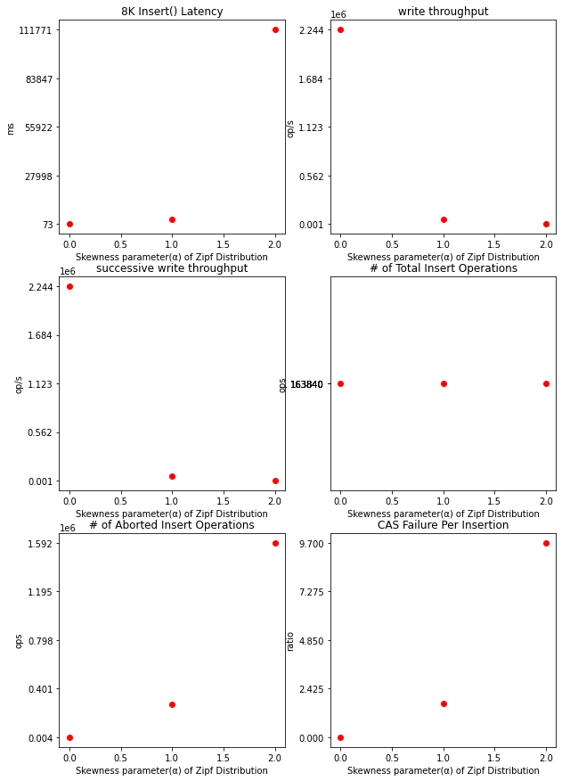
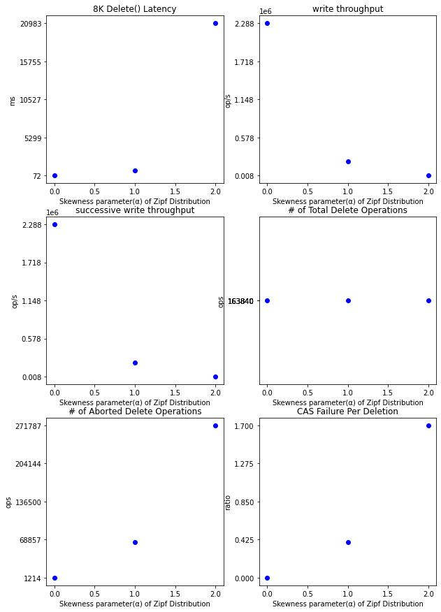
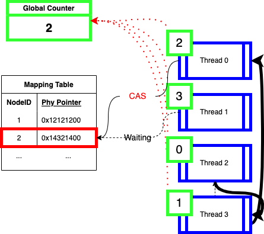
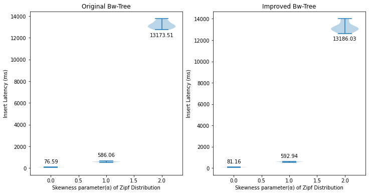
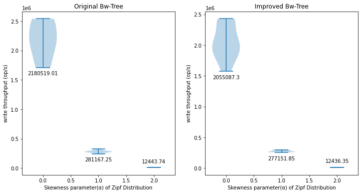
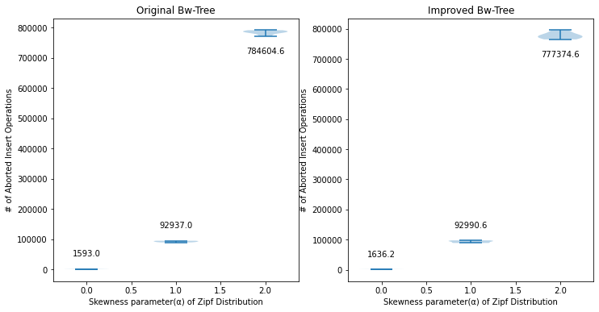
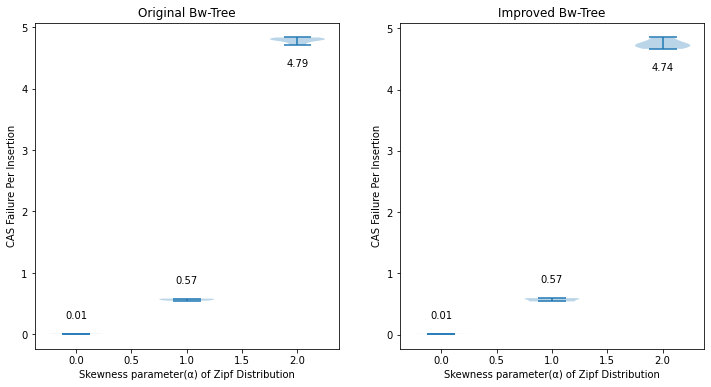

# 3. Improve the Bw-tree


## 1. Motivation

**Open Bw-tree** is a lock-free B-tree redesigned by Ziqi Wang et. al., 2018 to achieve cache friendliness and high concurrency for new hardware platforms such as multicore chips. The original version of Bw-tree was developed by Microsoft Research, although it lacks some important details and its public implementation.

To understand the design principles of the Open Bw-tree and search a way to improve it through scientific analysis,

1. Design various workloads to analyze the performance metrics of each workload
2. Benchmark the current Open Bw-tree on various workloads
3. Improve the Open Bw-tree according to the analysis


## 2. Benchmark of the current Bw-tree

> Test Environment
>
> 
>
> OS: Linux multicore-20 5.4.0-121-generic #137-Ubuntu
>
> CPU: Intel(R) Xeon(R) CPU E5-2630 v4 @ 2.20GHz (20 Cores = (Cores per socket = 10) * (# of sockets = 2))
>
> - L1d cache: 640 KiB
> - L1i cache: 640 KiB
> - L2 cache: 5 MiB
> - L3 cache: 50 MiB
>
> Memory: 
>
> gcc: gcc version 9.4.0 (Ubuntu 9.4.0-1ubuntu1~20.04.1)
>
> make: GNU Make 4.2.1
>
> cmake: cmake version 3.16.3
>
> perf: perf version 5.4.210


To understand which workload affects more critically to the performance of insertions and deletions of Bw-tree, I first propose a set of skewed workloads using **Zipf distribution generator** provided in the sample Bw-tree code.

Then, I measured the various metrics such as the latency/throughput of an operation, the number of successful/failed **CAS(Compare-and-Swap)** operations, and the ratio of failed **CAS** with respect to successful CAS operations with each workload.

By scrutinizing the metrics, I found the main bottleneck for Open Bw-tree could be **CAS operations** being performed on a few of **hot mapping table entries**, since the latency and ratio of CAS failure per insertion operation skyrockets as the skewness increases and it might lead to a huge amount of cache invalidation storms, which delays the whole insert progress. The same reason can be applied to the deletion, but it is less affected than that of the insertion.


### Insert Only Workload

> Brief Explanation of Insert Only Workload
>
> - 8K insertions per each thread
> - 20 Threads
>
> Total 160K Insertions are made into the Open Bw-tree
>
> To avoid the effect of generating random keys and values, all keys and values are pregenerated, stored into a thread local vector and then incrementally fetched by each thread later



|                Metric                 | Uniform Workload<br />(Zipf: alpha=0.0) | Slightly Skewed Workload<br />(Zipf: alpha=1.0) | Skewed Workload<br />(Zipf: alpha=2.0) |
| :-----------------------------------: | :-------------------------------------: | :---------------------------------------------: | :------------------------------------: |
|       8K Insert() Latency (ms)        |                  73.0                   |                     2981.8                      |                111771.3                |
|        write throughput (op/s)        |                2244254.1                |                     54946.2                     |                 1465.9                 |
|  successive write throughput (op/s)   |                2244254.1                |                     54946.2                     |                 1465.9                 |
|  \# of Total Insert Operations (ops)  |                163840.0                 |                    163840.0                     |                163840.0                |
| \# of Aborted Insert Operations (ops) |                 4242.0                  |                    271214.0                     |               1592268.0                |
|   CAS Failure Per Insertion (ratio)   |           0.0<br />(Rounded)            |                       1.7                       |                  9.7                   |


## Delete Only Workload

> Brief Explanation of Delete Only Workload
>
> To be deleted, insert all required keys in the tree
>
> - 160K insertions are first made into the Bw-tree
>
> To test the deletion,
>
> - 8K deletions per each thread
> - 20 Threads
>
> Total 160K deletions are made into the Open Bw-tree
>
> To avoid the effect of generating random keys and values, all keys and values are pregenerated, stored into a thread local vector and then incrementally fetched by each thread later



|                Metric                | Uniform Workload<br />(Zipf: alpha=0.0) | Slightly Skewed Workload<br />(Zipf: alpha=1.0) | Skewed Workload<br />(Zipf: alpha=2.0) |
| :----------------------------------: | :-------------------------------------: | :---------------------------------------------: | :------------------------------------: |
|       8K Delete() Latency (ms)       |                  71.6                   |                      733.8                      |                20983.0                 |
|       write throughput (op/s)        |                2288468.9                |                    223283.4                     |                 7808.2                 |
|  successive write throughput (op/s)  |                2288468.9                |                    223283.4                     |                 7808.2                 |
|  # of Total Delete Operations (ops)  |                163840.0                 |                    163840.0                     |                163840.0                |
| # of Aborted Delete Operations (ops) |                 1214.0                  |                     64448.0                     |                271787.0                |
|   CAS Failure Per Deletion (ratio)   |           0.0<br />(Rounded)            |                       0.4                       |                  1.7                   |


To check whether the main performance collapse for skewed workload is due to **hot CAS operations**, I tried **perf-c2c** to measure cache statistics of the proposed workload.

As the skewness goes higher, the total number of **HITM(Cache HIT Modified)** samples arises in both insertion-only and deletion-only workload.

> The **HITM** is an event that it needs to wait for reading the invalidated cache due to modification.
>
> **Local HITM** occurs where the cache is invalidated within the socket.
> However, **remote HITM** happens where the cache is invalidated outside the current CPU socket, which is critical to the performance and requires more cycles to get the cache valid.


#### Insert Only Workload

| Load HITM<br /># of Samples | Uniform Workload<br />(Zipf: alpha=0.0) | Slightly Skewed Workload<br />(Zipf: alpha=1.0) | Skewed Workload<br />(Zipf: alpha=2.0) |
| :-------------------------: | :-------------------------------------: | :---------------------------------------------: | :------------------------------------: |
|         Local HITM          |                   22                    |                       97                        |                  231                   |
|         Remote HITM         |                   17                    |                       224                       |                  1988                  |
|         Total HITM          |                   39                    |                       321                       |                  2219                  |


#### Delete Only Workload

| Load HITM<br /># of Samples | Uniform Workload<br />(Zipf: alpha=0.0) | Slightly Skewed Workload<br />(Zipf: alpha=1.0) | Skewed Workload<br />(Zipf: alpha=2.0) |
| :-------------------------: | :-------------------------------------: | :---------------------------------------------: | :------------------------------------: |
|         Local HITM          |                   52                    |                       709                       |                 37655                  |
|         Remote HITM         |                   119                   |                      1122                       |                 44857                  |
|         Total HITM          |                   171                   |                      1831                       |                 82512                  |


Further details are in [project3/perf_results/](https://hconnect.hanyang.ac.kr/2022_ite4065_10432/2022_ite4065_2017030473/-/tree/master/project3/perf_results).

Thus, the cache invalidation is the main performance bottleneck for skewed workload.


## 3. Problem Definition

> 


Frequent cache invalidation is the key to solve the CAS performance on mapping table entries.

## 4. Solution

In the current design, **CAS**ing to the mapping table is done <u>without consideration of other threads</u>.

By making a concrete order of **CAS operation** across multiple threads **CAS**ing could be done in less number of retries.



1. Use `atomic_fetch_add` operation to get an atomically-fetched sequence number for an operation
2. Until it reaches to global sequence number, wait for its turn.
3. By doing so, all **Insert** and **Delete** requests can be serializable and the number of retries will become smaller.

## 5. Performance Analysis

> Brief Explanation of Insert Only Workload (Same as the previous insert-only workload)
>
> - 8K insertions per each thread
> - 20 Threads
>
> Total 160K Insertions are made into the Open Bw-tree
>
> To avoid the effect of generating random keys and values, all keys and values are pregenerated, stored into a thread local vector and then incrementally fetched by each thread later
> 
> The metrics 'Insert Latency' and 'Write Throughput during Insertions' are tested by **release** binary of bwtree_test from 10 samples
> The metrics ' # of Aborted Insert Operations' and 'CAS Failure Ratio' are tested by **debug** binary of bwtree_test from 5 samples

### Insert Latency



## Write Throughput during Insertions



## # of Aborted Insert Operations



## CAS Failure Ratio



In overall, the performance did not improve.  
It is because the fetch_add could saturate the bandwidth of cpu buses and actually it is not the case where the cpu cache misses are problematic compared to the cost to traverse a long chain of delta nodes.

Although my design was able to lower a little bit of the CAS Failure Ratio, it didn't provide a dramatic amount of CAS Failure ratio decrease. This is why the cost of traversing a long delta chain is severe than what I expected.

## 6. How to build

1. `cd project3`
2. `./build_all.sh`
3. `./release/bin/bwtree_test`

# Full Bw-tree Benchmark Results

<details>
<summary>Click me to collapse/fold the result</summary>

```
./debug/bin/bwtree_test
Running main() from /home/2022_cp_project/student30473/ITE4065-main/project3/debug/_deps/googletest-src/googletest/src/gtest_main.cc
[==========] Running 17 tests from 3 test suites.
[----------] Global test environment set-up.
[----------] 6 tests from UtilTest
[ RUN      ] UtilTest.UniformDist_SeedTest
[       OK ] UtilTest.UniformDist_SeedTest (0 ms)
[ RUN      ] UtilTest.UniformDistTest
 1 ********** 106
 2 ********** 109
 3 ********** 102
 4 *********** 118
 5 ************* 133
 6 ********** 103
 7 ************* 133
 8 ********** 100
 9 ********* 96
[       OK ] UtilTest.UniformDistTest (0 ms)
[ RUN      ] UtilTest.ZipfDist_SeedTest
[       OK ] UtilTest.ZipfDist_SeedTest (0 ms)
[ RUN      ] UtilTest.ZipfDistTest_0
 1 ********** 105
 2 ************* 134
 3 ********** 101
 4 *********** 110
 5 *********** 118
 6 *********** 110
 7 *********** 119
 8 ********** 100
 9 ********** 103
[       OK ] UtilTest.ZipfDistTest_0 (0 ms)
[ RUN      ] UtilTest.ZipfDistTest_1
 1 *********************************** 357
 2 ****************** 186
 3 *********** 112
 4 ********* 97
 5 ****** 65
 6 ****** 62
 7 **** 42
 8 **** 45
 9 *** 34
[       OK ] UtilTest.ZipfDistTest_1 (0 ms)
[ RUN      ] UtilTest.ZipfDistTest_2
 1 ***************************************************************** 657
 2 **************** 161
 3 ******* 73
 4 *** 38
 5 ** 28
 6 * 17
 7 * 13
 8  9
 9  4
[       OK ] UtilTest.ZipfDistTest_2 (0 ms)
[----------] 6 tests from UtilTest (1 ms total)

[----------] 1 test from BwtreeInitTest
[ RUN      ] BwtreeInitTest.HandlesInitialization
[       OK ] BwtreeInitTest.HandlesInitialization (0 ms)
[----------] 1 test from BwtreeInitTest (0 ms total)

[----------] 10 tests from BwtreeTest
[ RUN      ] BwtreeTest.NonUniqueInsert
[       OK ] BwtreeTest.NonUniqueInsert (22754 ms)
[ RUN      ] BwtreeTest.UniqueInsert
[       OK ] BwtreeTest.UniqueInsert (53568 ms)
[ RUN      ] BwtreeTest.ConcurrentRandomInsert
[       OK ] BwtreeTest.ConcurrentRandomInsert (5400 ms)
[ RUN      ] BwtreeTest.ConcurrentMixed
[       OK ] BwtreeTest.ConcurrentMixed (28575 ms)
[ RUN      ] BwtreeTest.ConcurrentSkewedInsert_00
8K Insert(): 73.0 (ms), write throughput: 2244254.1 (op/s), successive write throughput: 2244254.1 (op/s)
# of Total Insert Operations: 163840
# of Aborted Insert Operations: 4242
CAS Failure Per Insertion: 0.0
[       OK ] BwtreeTest.ConcurrentSkewedInsert_00 (3510 ms)
[ RUN      ] BwtreeTest.ConcurrentSkewedInsert_10
8K Insert(): 2981.8 (ms), write throughput: 54946.2 (op/s), successive write throughput: 54946.2 (op/s)
# of Total Insert Operations: 163840
# of Aborted Insert Operations: 271214
CAS Failure Per Insertion: 1.7
[       OK ] BwtreeTest.ConcurrentSkewedInsert_10 (3872 ms)
[ RUN      ] BwtreeTest.ConcurrentSkewedInsert_20
8K Insert(): 111771.3 (ms), write throughput: 1465.9 (op/s), successive write throughput: 1465.9 (op/s)
# of Total Insert Operations: 163840
# of Aborted Insert Operations: 1592268
CAS Failure Per Insertion: 9.7
[       OK ] BwtreeTest.ConcurrentSkewedInsert_20 (111976 ms)
[ RUN      ] BwtreeTest.ConcurrentSkewedDelete_00
8K Delete(): 71.6 (ms), write throughput: 2288468.9 (op/s), successive write throughput: 2288468.9 (op/s)
# of Total Delete Operations: 163840
# of Aborted Delete Operations: 1214
CAS Failure Per Deletion: 0.0
[       OK ] BwtreeTest.ConcurrentSkewedDelete_00 (3537 ms)
[ RUN      ] BwtreeTest.ConcurrentSkewedDelete_10
8K Delete(): 733.8 (ms), write throughput: 223283.4 (op/s), successive write throughput: 223283.4 (op/s)
# of Total Delete Operations: 163840
# of Aborted Delete Operations: 64448
CAS Failure Per Deletion: 0.4
[       OK ] BwtreeTest.ConcurrentSkewedDelete_10 (5638 ms)
[ RUN      ] BwtreeTest.ConcurrentSkewedDelete_20
8K Delete(): 20983.0 (ms), write throughput: 7808.2 (op/s), successive write throughput: 7808.2 (op/s)
# of Total Delete Operations: 163840
# of Aborted Delete Operations: 271787
CAS Failure Per Deletion: 1.7
[       OK ] BwtreeTest.ConcurrentSkewedDelete_20 (150459 ms)
[----------] 10 tests from BwtreeTest (389293 ms total)

[----------] Global test environment tear-down
[==========] 17 tests from 3 test suites ran. (389295 ms total)
[  PASSED  ] 17 tests.
```

</details>

<details>
<summary>Click me to collapse/fold the result of jemalloc library version</summary>

```
student30473@multicore-20:~/2022_ite4065_2017030473/project3$ ./debug/bin/bwtree_test
Running main() from /home/2022_cp_project/student30473/2022_ite4065_2017030473/project3/debug/_deps/googletest-src/googletest/src/gtest_main.cc
[==========] Running 17 tests from 3 test suites.
[----------] Global test environment set-up.
[----------] 6 tests from UtilTest
[ RUN      ] UtilTest.UniformDist_SeedTest
[       OK ] UtilTest.UniformDist_SeedTest (0 ms)
[ RUN      ] UtilTest.UniformDistTest
 1 ********** 106
 2 ********** 109
 3 ********** 102
 4 *********** 118
 5 ************* 133
 6 ********** 103
 7 ************* 133
 8 ********** 100
 9 ********* 96
[       OK ] UtilTest.UniformDistTest (0 ms)
[ RUN      ] UtilTest.ZipfDist_SeedTest
[       OK ] UtilTest.ZipfDist_SeedTest (0 ms)
[ RUN      ] UtilTest.ZipfDistTest_0
 1 ********** 105
 2 ************* 134
 3 ********** 101
 4 *********** 110
 5 *********** 118
 6 *********** 110
 7 *********** 119
 8 ********** 100
 9 ********** 103
[       OK ] UtilTest.ZipfDistTest_0 (0 ms)
[ RUN      ] UtilTest.ZipfDistTest_1
 1 *********************************** 357
 2 ****************** 186
 3 *********** 112
 4 ********* 97
 5 ****** 65
 6 ****** 62
 7 **** 42
 8 **** 45
 9 *** 34
[       OK ] UtilTest.ZipfDistTest_1 (0 ms)
[ RUN      ] UtilTest.ZipfDistTest_2
 1 ***************************************************************** 657
 2 **************** 161
 3 ******* 73
 4 *** 38
 5 ** 28
 6 * 17
 7 * 13
 8  9
 9  4
[       OK ] UtilTest.ZipfDistTest_2 (0 ms)
[----------] 6 tests from UtilTest (1 ms total)

[----------] 1 test from BwtreeInitTest
[ RUN      ] BwtreeInitTest.HandlesInitialization
[       OK ] BwtreeInitTest.HandlesInitialization (0 ms)
[----------] 1 test from BwtreeInitTest (0 ms total)

[----------] 10 tests from BwtreeTest
[ RUN      ] BwtreeTest.NonUniqueInsert
[       OK ] BwtreeTest.NonUniqueInsert (21088 ms)
[ RUN      ] BwtreeTest.UniqueInsert
[       OK ] BwtreeTest.UniqueInsert (50813 ms)
[ RUN      ] BwtreeTest.ConcurrentRandomInsert
[       OK ] BwtreeTest.ConcurrentRandomInsert (5528 ms)
[ RUN      ] BwtreeTest.ConcurrentMixed
[       OK ] BwtreeTest.ConcurrentMixed (30692 ms)
[ RUN      ] BwtreeTest.ConcurrentSkewedInsert_00
8K Insert(): 107.0 (ms), write throughput: 1531011.9 (op/s), successive write throughput: 1531011.9 (op/s)
# of Total Insert Operations: 163840
# of Aborted Insert Operations: 4295
CAS Failure Per Insertion: 0.0
[       OK ] BwtreeTest.ConcurrentSkewedInsert_00 (3497 ms)
[ RUN      ] BwtreeTest.ConcurrentSkewedInsert_10
8K Insert(): 2941.5 (ms), write throughput: 55699.8 (op/s), successive write throughput: 55699.8 (op/s)
# of Total Insert Operations: 163840
# of Aborted Insert Operations: 240069
CAS Failure Per Insertion: 1.5
[       OK ] BwtreeTest.ConcurrentSkewedInsert_10 (3864 ms)
[ RUN      ] BwtreeTest.ConcurrentSkewedInsert_20
8K Insert(): 98587.8 (ms), write throughput: 1661.9 (op/s), successive write throughput: 1661.9 (op/s)
# of Total Insert Operations: 163840
# of Aborted Insert Operations: 1714134
CAS Failure Per Insertion: 10.5
[       OK ] BwtreeTest.ConcurrentSkewedInsert_20 (98770 ms)
[ RUN      ] BwtreeTest.ConcurrentSkewedDelete_00
8K Delete(): 69.6 (ms), write throughput: 2354512.9 (op/s), successive write throughput: 2354512.9 (op/s)
# of Total Delete Operations: 163840
# of Aborted Delete Operations: 1065
CAS Failure Per Deletion: 0.0
[       OK ] BwtreeTest.ConcurrentSkewedDelete_00 (3608 ms)
[ RUN      ] BwtreeTest.ConcurrentSkewedDelete_10
8K Delete(): 611.7 (ms), write throughput: 267848.1 (op/s), successive write throughput: 267848.1 (op/s)
# of Total Delete Operations: 163840
# of Aborted Delete Operations: 98299
CAS Failure Per Deletion: 0.6
[       OK ] BwtreeTest.ConcurrentSkewedDelete_10 (5982 ms)
[ RUN      ] BwtreeTest.ConcurrentSkewedDelete_20
8K Delete(): 16610.0 (ms), write throughput: 9864.0 (op/s), successive write throughput: 9864.0 (op/s)
# of Total Delete Operations: 163840
# of Aborted Delete Operations: 335147
CAS Failure Per Deletion: 2.0
[       OK ] BwtreeTest.ConcurrentSkewedDelete_20 (160274 ms)
[----------] 10 tests from BwtreeTest (384120 ms total)

[----------] Global test environment tear-down
[==========] 17 tests from 3 test suites ran. (384122 ms total)
[  PASSED  ] 17 tests.
```

</details>

<details>
<summary>Click me to collapse/fold the result of release binary</summary>

```
student30473@multicore-20:~/2022_ite4065_2017030473/project3$ ./release/bin/bwtree_test
Running main() from /home/2022_cp_project/student30473/2022_ite4065_2017030473/project3/release/_deps/googletest-src/googletest/src/gtest_main.cc
[==========] Running 17 tests from 3 test suites.
[----------] Global test environment set-up.
[----------] 6 tests from UtilTest
[ RUN      ] UtilTest.UniformDist_SeedTest
[       OK ] UtilTest.UniformDist_SeedTest (0 ms)
[ RUN      ] UtilTest.UniformDistTest
 1 ********** 106
 2 ********** 109
 3 ********** 102
 4 *********** 118
 5 ************* 133
 6 ********** 103
 7 ************* 133
 8 ********** 100
 9 ********* 96
[       OK ] UtilTest.UniformDistTest (0 ms)
[ RUN      ] UtilTest.ZipfDist_SeedTest
[       OK ] UtilTest.ZipfDist_SeedTest (0 ms)
[ RUN      ] UtilTest.ZipfDistTest_0
 1 ********** 105
 2 ************* 134
 3 ********** 101
 4 *********** 110
 5 *********** 118
 6 *********** 110
 7 *********** 119
 8 ********** 100
 9 ********** 103
[       OK ] UtilTest.ZipfDistTest_0 (0 ms)
[ RUN      ] UtilTest.ZipfDistTest_1
 1 *********************************** 357
 2 ****************** 186
 3 *********** 112
 4 ********* 97
 5 ****** 65
 6 ****** 62
 7 **** 42
 8 **** 45
 9 *** 34
[       OK ] UtilTest.ZipfDistTest_1 (0 ms)
[ RUN      ] UtilTest.ZipfDistTest_2
 1 ***************************************************************** 657
 2 **************** 161
 3 ******* 73
 4 *** 38
 5 ** 28
 6 * 17
 7 * 13
 8  9
 9  4
[       OK ] UtilTest.ZipfDistTest_2 (0 ms)
[----------] 6 tests from UtilTest (0 ms total)

[----------] 1 test from BwtreeInitTest
[ RUN      ] BwtreeInitTest.HandlesInitialization
[       OK ] BwtreeInitTest.HandlesInitialization (0 ms)
[----------] 1 test from BwtreeInitTest (0 ms total)

[----------] 10 tests from BwtreeTest
[ RUN      ] BwtreeTest.NonUniqueInsert
[       OK ] BwtreeTest.NonUniqueInsert (12307 ms)
[ RUN      ] BwtreeTest.UniqueInsert
[       OK ] BwtreeTest.UniqueInsert (14498 ms)
[ RUN      ] BwtreeTest.ConcurrentRandomInsert
[       OK ] BwtreeTest.ConcurrentRandomInsert (2339 ms)
[ RUN      ] BwtreeTest.ConcurrentMixed
[       OK ] BwtreeTest.ConcurrentMixed (14567 ms)
[ RUN      ] BwtreeTest.ConcurrentSkewedInsert_00
8K Insert(): 55.3 (ms), write throughput: 2960769.3 (op/s), successive write throughput: 2960769.3 (op/s)
[       OK ] BwtreeTest.ConcurrentSkewedInsert_00 (1044 ms)
[ RUN      ] BwtreeTest.ConcurrentSkewedInsert_10
8K Insert(): 569.7 (ms), write throughput: 287580.5 (op/s), successive write throughput: 287580.5 (op/s)
[       OK ] BwtreeTest.ConcurrentSkewedInsert_10 (901 ms)
[ RUN      ] BwtreeTest.ConcurrentSkewedInsert_20
8K Insert(): 17496.5 (ms), write throughput: 9364.1 (op/s), successive write throughput: 9364.1 (op/s)
[       OK ] BwtreeTest.ConcurrentSkewedInsert_20 (17569 ms)
[ RUN      ] BwtreeTest.ConcurrentSkewedDelete_00
8K Delete(): 45.5 (ms), write throughput: 3604427.3 (op/s), successive write throughput: 3604427.3 (op/s)
[       OK ] BwtreeTest.ConcurrentSkewedDelete_00 (1077 ms)
[ RUN      ] BwtreeTest.ConcurrentSkewedDelete_10
8K Delete(): 595.5 (ms), write throughput: 275114.2 (op/s), successive write throughput: 275114.2 (op/s)
[       OK ] BwtreeTest.ConcurrentSkewedDelete_10 (1479 ms)
[ RUN      ] BwtreeTest.ConcurrentSkewedDelete_20
8K Delete(): 14663.2 (ms), write throughput: 11173.5 (op/s), successive write throughput: 11173.5 (op/s)
[       OK ] BwtreeTest.ConcurrentSkewedDelete_20 (28585 ms)
[----------] 10 tests from BwtreeTest (94372 ms total)

[----------] Global test environment tear-down
[==========] 17 tests from 3 test suites ran. (94373 ms total)
[  PASSED  ] 17 tests.
```

</details>

<details>
<summary>Click me to collapse/fold the result of release binary with jemalloc library version</summary>

```
student30473@multicore-20:~/2022_ite4065_2017030473/project3$ ./release/bin/bwtree_test
Running main() from /home/2022_cp_project/student30473/2022_ite4065_2017030473/project3/release/_deps/googletest-src/googletest/src/gtest_main.cc
[==========] Running 17 tests from 3 test suites.
[----------] Global test environment set-up.
[----------] 6 tests from UtilTest
[ RUN      ] UtilTest.UniformDist_SeedTest
[       OK ] UtilTest.UniformDist_SeedTest (0 ms)
[ RUN      ] UtilTest.UniformDistTest
 1 ********** 106
 2 ********** 109
 3 ********** 102
 4 *********** 118
 5 ************* 133
 6 ********** 103
 7 ************* 133
 8 ********** 100
 9 ********* 96
[       OK ] UtilTest.UniformDistTest (0 ms)
[ RUN      ] UtilTest.ZipfDist_SeedTest
[       OK ] UtilTest.ZipfDist_SeedTest (0 ms)
[ RUN      ] UtilTest.ZipfDistTest_0
 1 ********** 105
 2 ************* 134
 3 ********** 101
 4 *********** 110
 5 *********** 118
 6 *********** 110
 7 *********** 119
 8 ********** 100
 9 ********** 103
[       OK ] UtilTest.ZipfDistTest_0 (0 ms)
[ RUN      ] UtilTest.ZipfDistTest_1
 1 *********************************** 357
 2 ****************** 186
 3 *********** 112
 4 ********* 97
 5 ****** 65
 6 ****** 62
 7 **** 42
 8 **** 45
 9 *** 34
[       OK ] UtilTest.ZipfDistTest_1 (0 ms)
[ RUN      ] UtilTest.ZipfDistTest_2
 1 ***************************************************************** 657
 2 **************** 161
 3 ******* 73
 4 *** 38
 5 ** 28
 6 * 17
 7 * 13
 8  9
 9  4
[       OK ] UtilTest.ZipfDistTest_2 (0 ms)
[----------] 6 tests from UtilTest (0 ms total)

[----------] 1 test from BwtreeInitTest
[ RUN      ] BwtreeInitTest.HandlesInitialization
[       OK ] BwtreeInitTest.HandlesInitialization (0 ms)
[----------] 1 test from BwtreeInitTest (0 ms total)

[----------] 10 tests from BwtreeTest
[ RUN      ] BwtreeTest.NonUniqueInsert
[       OK ] BwtreeTest.NonUniqueInsert (7159 ms)
[ RUN      ] BwtreeTest.UniqueInsert
[       OK ] BwtreeTest.UniqueInsert (9651 ms)
[ RUN      ] BwtreeTest.ConcurrentRandomInsert
[       OK ] BwtreeTest.ConcurrentRandomInsert (2373 ms)
[ RUN      ] BwtreeTest.ConcurrentMixed
[       OK ] BwtreeTest.ConcurrentMixed (8224 ms)
[ RUN      ] BwtreeTest.ConcurrentSkewedInsert_00
8K Insert(): 91.9 (ms), write throughput: 1782952.9 (op/s), successive write throughput: 1782952.9 (op/s)
[       OK ] BwtreeTest.ConcurrentSkewedInsert_00 (1055 ms)
[ RUN      ] BwtreeTest.ConcurrentSkewedInsert_10
8K Insert(): 548.0 (ms), write throughput: 298983.2 (op/s), successive write throughput: 298983.2 (op/s)
[       OK ] BwtreeTest.ConcurrentSkewedInsert_10 (898 ms)
[ RUN      ] BwtreeTest.ConcurrentSkewedInsert_20
8K Insert(): 17679.4 (ms), write throughput: 9267.3 (op/s), successive write throughput: 9267.3 (op/s)
[       OK ] BwtreeTest.ConcurrentSkewedInsert_20 (17767 ms)
[ RUN      ] BwtreeTest.ConcurrentSkewedDelete_00
8K Delete(): 72.6 (ms), write throughput: 2258263.3 (op/s), successive write throughput: 2258263.3 (op/s)
[       OK ] BwtreeTest.ConcurrentSkewedDelete_00 (1131 ms)
[ RUN      ] BwtreeTest.ConcurrentSkewedDelete_10
8K Delete(): 490.8 (ms), write throughput: 333798.9 (op/s), successive write throughput: 333798.9 (op/s)
[       OK ] BwtreeTest.ConcurrentSkewedDelete_10 (1353 ms)
[ RUN      ] BwtreeTest.ConcurrentSkewedDelete_20
8K Delete(): 17329.6 (ms), write throughput: 9454.3 (op/s), successive write throughput: 9454.3 (op/s)
[       OK ] BwtreeTest.ConcurrentSkewedDelete_20 (34114 ms)
[----------] 10 tests from BwtreeTest (83730 ms total)

[----------] Global test environment tear-down
[==========] 17 tests from 3 test suites ran. (83732 ms total)
[  PASSED  ] 17 tests.
```

</details>

<details>
<summary>Click me to collapse/fold the result of release binary with improved sorted_set</summary>

```
student30473@multicore-20:~/2022_ite4065_2017030473/project3$ ./release/bin/bwtree_test
Running main() from /home/2022_cp_project/student30473/2022_ite4065_2017030473/project3/release/_deps/googletest-src/googletest/src/gtest_main.cc
[==========] Running 17 tests from 3 test suites.
[----------] Global test environment set-up.
[----------] 6 tests from UtilTest
[ RUN      ] UtilTest.UniformDist_SeedTest
[       OK ] UtilTest.UniformDist_SeedTest (0 ms)
[ RUN      ] UtilTest.UniformDistTest
 1 ********** 106
 2 ********** 109
 3 ********** 102
 4 *********** 118
 5 ************* 133
 6 ********** 103
 7 ************* 133
 8 ********** 100
 9 ********* 96
[       OK ] UtilTest.UniformDistTest (0 ms)
[ RUN      ] UtilTest.ZipfDist_SeedTest
[       OK ] UtilTest.ZipfDist_SeedTest (0 ms)
[ RUN      ] UtilTest.ZipfDistTest_0
 1 ********** 105
 2 ************* 134
 3 ********** 101
 4 *********** 110
 5 *********** 118
 6 *********** 110
 7 *********** 119
 8 ********** 100
 9 ********** 103
[       OK ] UtilTest.ZipfDistTest_0 (0 ms)
[ RUN      ] UtilTest.ZipfDistTest_1
 1 *********************************** 357
 2 ****************** 186
 3 *********** 112
 4 ********* 97
 5 ****** 65
 6 ****** 62
 7 **** 42
 8 **** 45
 9 *** 34
[       OK ] UtilTest.ZipfDistTest_1 (0 ms)
[ RUN      ] UtilTest.ZipfDistTest_2
 1 ***************************************************************** 657
 2 **************** 161
 3 ******* 73
 4 *** 38
 5 ** 28
 6 * 17
 7 * 13
 8  9
 9  4
[       OK ] UtilTest.ZipfDistTest_2 (0 ms)
[----------] 6 tests from UtilTest (0 ms total)

[----------] 1 test from BwtreeInitTest
[ RUN      ] BwtreeInitTest.HandlesInitialization
[       OK ] BwtreeInitTest.HandlesInitialization (0 ms)
[----------] 1 test from BwtreeInitTest (0 ms total)

[----------] 10 tests from BwtreeTest
[ RUN      ] BwtreeTest.NonUniqueInsert
[       OK ] BwtreeTest.NonUniqueInsert (11273 ms)
[ RUN      ] BwtreeTest.UniqueInsert
[       OK ] BwtreeTest.UniqueInsert (14542 ms)
[ RUN      ] BwtreeTest.ConcurrentRandomInsert
[       OK ] BwtreeTest.ConcurrentRandomInsert (2369 ms)
[ RUN      ] BwtreeTest.ConcurrentMixed
[       OK ] BwtreeTest.ConcurrentMixed (15097 ms)
[ RUN      ] BwtreeTest.ConcurrentSkewedInsert_00
8K Insert(): 53.4 (ms), write throughput: 3070329.2 (op/s), successive write throughput: 3070329.2 (op/s)
[       OK ] BwtreeTest.ConcurrentSkewedInsert_00 (1057 ms)
[ RUN      ] BwtreeTest.ConcurrentSkewedInsert_10
8K Insert(): 584.4 (ms), write throughput: 280355.0 (op/s), successive write throughput: 280355.0 (op/s)
[       OK ] BwtreeTest.ConcurrentSkewedInsert_10 (982 ms)
[ RUN      ] BwtreeTest.ConcurrentSkewedInsert_20
8K Insert(): 17740.4 (ms), write throughput: 9235.4 (op/s), successive write throughput: 9235.4 (op/s)
[       OK ] BwtreeTest.ConcurrentSkewedInsert_20 (17841 ms)
[ RUN      ] BwtreeTest.ConcurrentSkewedDelete_00
8K Delete(): 50.9 (ms), write throughput: 3220072.8 (op/s), successive write throughput: 3220072.8 (op/s)
[       OK ] BwtreeTest.ConcurrentSkewedDelete_00 (1068 ms)
[ RUN      ] BwtreeTest.ConcurrentSkewedDelete_10
8K Delete(): 581.6 (ms), write throughput: 281709.3 (op/s), successive write throughput: 281709.3 (op/s)
[       OK ] BwtreeTest.ConcurrentSkewedDelete_10 (1472 ms)
[ RUN      ] BwtreeTest.ConcurrentSkewedDelete_20
8K Delete(): 14497.9 (ms), write throughput: 11300.9 (op/s), successive write throughput: 11300.9 (op/s)
[       OK ] BwtreeTest.ConcurrentSkewedDelete_20 (30098 ms)
[----------] 10 tests from BwtreeTest (95804 ms total)

[----------] Global test environment tear-down
[==========] 17 tests from 3 test suites ran. (95805 ms total)
[  PASSED  ] 17 tests.
```

</details>