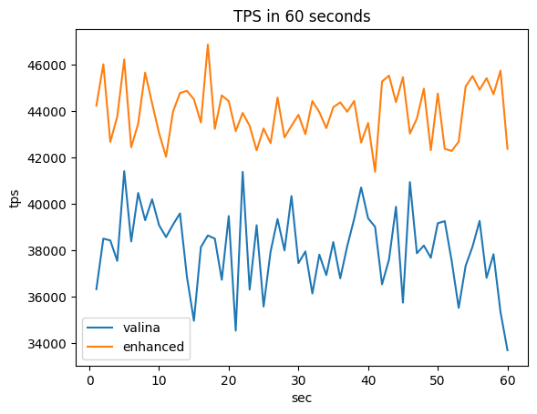
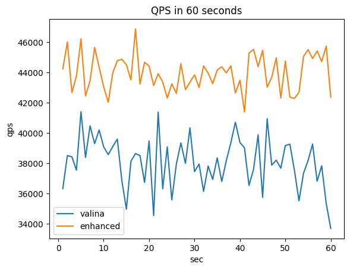

# 4. Border-collie on PostgreSQL


## 1. Overall design of your implementation


### Border-Collie Structure for Current Enhancement

```c
union BorderCollieFlagData{
    struct{
        bool isWorking;
        uint64_t pid;
        uint64_t LSN;
    } flag;
    char padd[128];
};
typedef union BorderCollieFlagData Flag;
```

bool isWorking: a state field to represent whther the worker is adding a log or not

uint64_t pid: a process identifier to identify each process

uint64_t LSN: a LSN is log sequence number to identify each log item

char padd[128]: This padding is for avoiding cache invalidation occuring by adjacent flag updates


### BorderCollie Algorithm for Current Enhancement

```c
uint64_t
BorderCollie(void)
{
	uint64_t cutoff, RLB;

  // 1. Find the global LSN using iteration
	cutoff = 0;
	for(int i = 0; i < NBorderCollieFlags; i++){
		if(BorderCollieFlags[i].flag.pid)
			cutoff = MAX(cutoff, BorderCollieFlags[i].flag.LSN);
	}

  // 2. Set the RLB to the global LSN
	RLB = cutoff;

  // 3. Implement the border-collie algorithm
	for(int i = 0; i < NBorderCollieFlags; i++){
		if(BorderCollieFlags[i].flag.pid){
			if(BorderCollieFlags[i].flag.isWorking)
				RLB = MIN(RLB, BorderCollieFlags[i].flag.LSN);
			else
				RLB = MIN(RLB, MAX(cutoff, BorderCollieFlags[i].flag.LSN));
		}
	}

  // 4. Return the RLB(Recoverable Logging Boundary)
	return RLB;
}
```

1. Find the global LSN using iteration
2. Set the RLB to the global LSN
3. Implement the border-collie algorithm
4. Return the RLB(Recoverable Logging Boundary)


### To collect ongoing LSNs of each thread

```c
#ifdef USE_BORDER_COLLIE
		if(!BorderCollieFlags[MyProcPid % NBorderCollieFlags].flag.pid)
			BorderCollieFlags[MyProcPid % NBorderCollieFlags].flag.pid = MyProcPid;
		BorderCollieFlags[MyProcPid % NBorderCollieFlags].flag.isWorking = true;
#endif
 		XLogWrite(WriteRqst, /* ~ */, /* ~ */);
#ifdef USE_BORDER_COLLIE
		BorderCollieFlags[MyProcPid % NBorderCollieFlags].flag.LSN = WriteRqst.Write;
		BorderCollieFlags[MyProcPid % NBorderCollieFlags].flag.isWorking = false;
#endif
```

Insert the border-collie-required marks into the <u>prologue</u> and <u>epilogue</u> of **XLogWrite** to collect state and LSNs of the current thread.


## 2. Details on non-trivial issues that you faced


## IPC via Shared Memory

The inter-process communication through the shared memory must be required to properly synchronize with other processes.


## Correct Declarations for referencing the border-collie mechanism

- extern Flag *BorderCollieFlags;
- extern uint64_t BorderCollie(void);


## 3. Performance Analysis of the new version


> Test Environment
>
> Mac OSX 13.0 (22A380)
>
> Apple clang version 14.0.0
>
> GNU Make 3.8
>
> 8 Cores / 16 Threads






### SQL Statistics

Running in 60 seconds

|                               | Vanila     | Border-Collie |
| ----------------------------- | ---------- | ------------- |
| Write Queries Performed (qpm) | 2285333    | 2638135       |
| Ignored Errors Count          | 13         | 15            |
| Throughput Events/s (eps)     | 38081.6174 | 43941.3969    |
| Average Latency (ms)          | 0.42       | 0.36          |
| Minimum Latency (ms)          | 0.06       | 0.05          |
| Maximum Latency (ms)          | 376.11     | 413.82        |


- The overall throughput of PostgreSQL has increased by about 15.3%.
- The average latency of PostgreSQL has decreased by about 14.2%.

Detail Results are in project4/vanila.txt and project4/enhanced.txt.